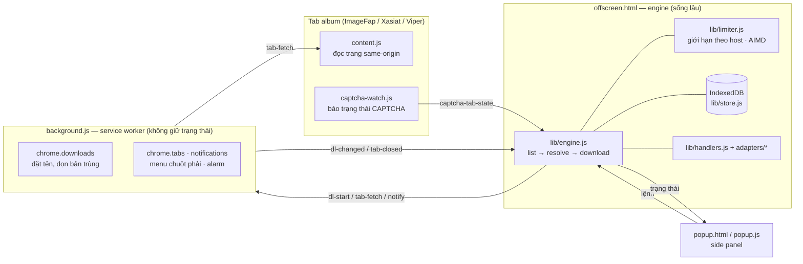
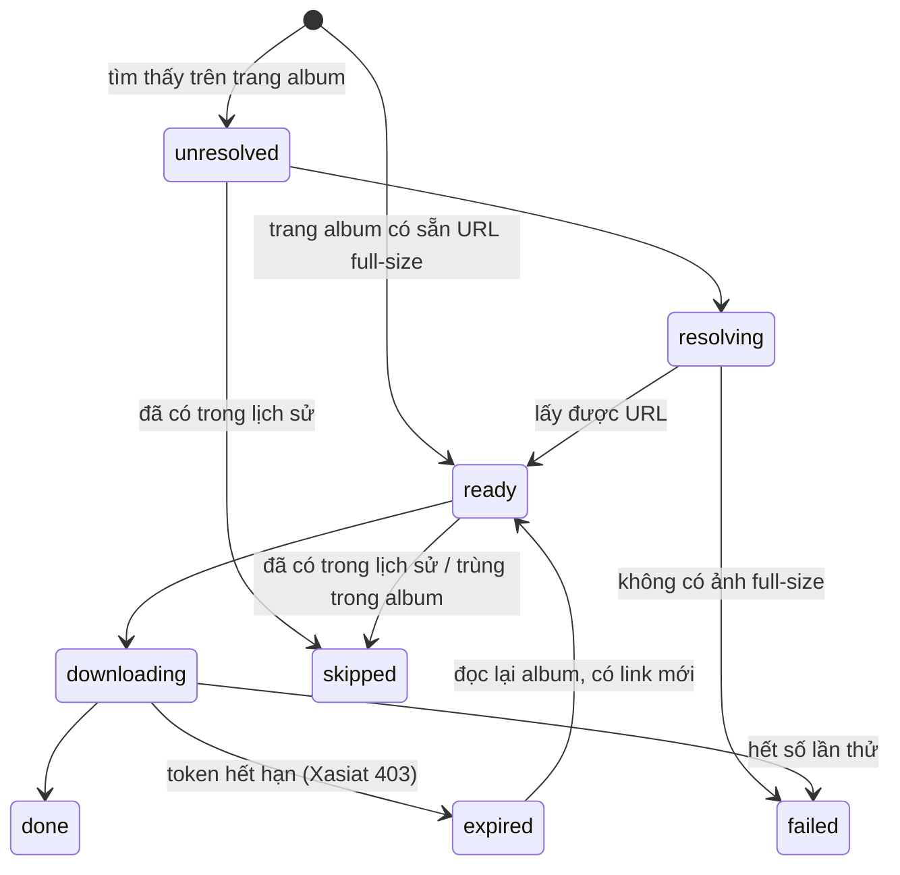

# Max Downloader — ImageFap · Xasiat · Viper

Extension Chrome (Manifest V3) tải ảnh **full-size** từ album ImageFap, album Xasiat và thread ViperGirls về máy. Extension có hàng đợi nhiều album và tự tiếp tục khi bị gián đoạn. Tốc độ được giới hạn chung theo từng host để hạn chế bị chặn. Toàn bộ chạy cục bộ trong trình duyệt: không server, không gửi dữ liệu ra ngoài, không thư viện bên thứ ba.

> Phiên bản hiện tại: **0.8.0** · Chrome/Edge ≥ 116 · Brave dùng được (xem [Brave](#brave))

---

## Mục lục

1. [Tính năng](#tính-năng)
2. [Site hỗ trợ](#site-hỗ-trợ)
3. [Cài đặt](#cài-đặt)
4. [Hướng dẫn sử dụng](#hướng-dẫn-sử-dụng)
5. [Cài đặt trong extension](#cài-đặt-trong-extension)
6. [Nơi lưu file và cách đặt tên](#nơi-lưu-file-và-cách-đặt-tên)
7. [Kiến trúc](#kiến-trúc)
8. [Cấu trúc mã nguồn](#cấu-trúc-mã-nguồn)
9. [Dữ liệu được lưu](#dữ-liệu-được-lưu)
10. [Quyền của extension](#quyền-của-extension)
11. [Phát triển và kiểm thử](#phát-triển-và-kiểm-thử)
12. [Thêm site mới](#thêm-site-mới)
13. [Xử lý sự cố](#xử-lý-sự-cố)
14. [Lịch sử phiên bản](#lịch-sử-phiên-bản)
15. [Giới hạn có chủ ý](#giới-hạn-có-chủ-ý)

---

## Tính năng

**Tải**

- Tải cả album (mọi trang phân trang) hoặc chỉ trang đang mở.
- Ảnh bắt đầu tải ngay khi trang album đầu tiên được đọc xong: đọc trang, lấy URL full-size và tải file chạy song song.
- **Hàng đợi nhiều album**: dán nhiều link cùng lúc, thêm từ menu chuột phải, đổi thứ tự, chọn số album chạy cùng lúc.
- **Bỏ qua ảnh đã tải** ở các lần trước. Lịch sử không giới hạn số lượng. Với ImageFap/Xasiat, ảnh đã tải được bỏ qua mà không cần mở trang ảnh.
- **Quét lại** một album đã tải để lấy ảnh mới thêm vào. **Thử lại** riêng các ảnh lỗi.

**Bền bỉ**

- Chrome tắt service worker, engine bị đóng hay trình duyệt khởi động lại thì job vẫn **chạy tiếp từ đúng ảnh, đúng trang đang dở**.
- Download đang dở từ trước được nhận lại, không tải trùng. Nếu vẫn phát sinh bản sao `tên (1).jpg` thì bản sao đó tự bị xoá.
- Đóng hoặc reload tab album không dừng job; engine chuyển sang đọc trang từ nền.

**Lịch sự với server**

- **Giới hạn tốc độ theo host, dùng chung** cho mọi album: hai album cùng site không gửi gấp đôi request.
- Tự điều chỉnh số luồng theo kiểu AIMD: giảm một nửa khi gặp 429/503, tăng dần khi ổn định. Tôn trọng header `Retry-After`.
- Gặp **CAPTCHA** thì tạm dừng mọi request tới host đó. Bạn xác minh thủ công, extension tự nhận ra và tiếp tục đúng request bị chặn.

**Riêng từng site**

- ImageFap: tận dụng URL full-size của các ảnh lân cận có sẵn trong trang ảnh, bớt được request.
- Xasiat: link ảnh có token hết hạn (403) thì tự đọc lại album để lấy link mới.
- Viper: nhận ảnh từ IMX, PiXhost, ImageVenue, PhotosEx, ảnh trực tiếp và cả host lạ có trang viewer. Ảnh được nhóm theo forum và tiêu đề bài post.

**Tiện ích**

- Side panel với thanh tiến độ, tốc độ (ảnh/phút), thời gian còn lại, bộ lọc và thanh cảnh báo.
- Ghi thẳng vào một thư mục tự chọn (File System Access), không cần giữ panel mở.
- Thông báo hệ thống khi xong hoặc khi cần xác minh.
- Sao lưu / nhập catalog (JSON) và xuất nhật ký để chẩn đoán.

## Site hỗ trợ

| Site | Trang dùng được | Cách lấy ảnh full-size |
|---|---|---|
| **ImageFap** | Album `…/pictures/<id>/…`, `gallery.php?gid=…`, trang ảnh `…/photo/<id>/` | Link gallery có sẵn bản `full/large/original` thì dùng luôn; nếu không thì mở trang ảnh để lấy |
| **Xasiat** | Album `…/albums/<id>/<slug>/` | Link `/get_image/…/sources/…` ngay trong trang album (có token) |
| **Viper** | Thread `viper.to/threads/<id>-<slug>` và các trang `/pageN` | Quy tắc theo host (IMX, PiXhost, ImageVenue, PhotosEx); host lạ thì mở trang viewer rồi kiểm tra đó có phải ảnh không |

Trang ImageFap dạng ảnh đơn: bật "Tải cả album" thì extension tìm ra album chứa ảnh đó và tải cả album; tắt thì chỉ tải ảnh đó.

## Cài đặt

1. Tải mã nguồn: `git clone https://github.com/peakpoint-foto/maxdownloader-extension.git`, hoặc tải ZIP rồi giải nén.
2. Mở `chrome://extensions` (Edge: `edge://extensions`) và bật **Developer mode**.
3. Bấm **Load unpacked**, chọn thư mục chứa `manifest.json`.
4. Reload các tab ImageFap / Xasiat / Viper đang mở để content script được nạp.
5. Ghim icon extension lên thanh công cụ. Bấm vào để mở **side panel**. Trình duyệt không có side panel sẽ mở một cửa sổ điều khiển riêng.

**Cập nhật lên bản mới:** `git pull`, rồi bấm **Reload** trên thẻ extension ở `chrome://extensions`.

**Nâng cấp từ 0.5.x:** lần chạy đầu, catalog, lịch sử ảnh đã tải và cài đặt cũ được tự chuyển sang kho dữ liệu mới. Dữ liệu cũ trong `chrome.storage` vẫn giữ nguyên làm bản sao lưu.

> Nếu Chrome bật **"Hỏi vị trí lưu cho mỗi file"** (Settings → Downloads), hãy tắt đi. Nếu không, mỗi ảnh sẽ bật một hộp thoại. Extension không được phép tự đổi cài đặt này.

### Brave

Brave dùng được bình thường. Riêng tính năng **Thư mục tự chọn** cần bật `brave://flags/#file-system-access-api`, sau đó khởi động lại Brave.

## Hướng dẫn sử dụng

### Tải album đang mở

1. Mở một album, ảnh hoặc thread được hỗ trợ.
2. Mở side panel. Khối trên cùng hiện site, URL và tiêu đề trang.
3. Bấm **Tải cả album**. Mũi tên bên cạnh cho chọn **Chỉ tải trang này**.
4. Album được thêm vào hàng đợi và chạy ngay nếu còn chỗ.

Có thể bấm chuột phải lên trang → **Tải album/thread này (Max Downloader)**.

### Thêm nhiều album

- Dán link vào ô *"Dán link album, mỗi dòng một link"*, rồi bấm **+** hoặc **Ctrl+Enter**. Ô sẽ báo có bao nhiêu link hợp lệ; link không hỗ trợ bị bỏ qua.
- Hoặc bấm chuột phải lên một link → **Thêm link này vào hàng đợi tải**.

Album chạy lần lượt theo thứ tự trong hàng đợi. Số album chạy cùng lúc chỉnh trong *Cài đặt → Nâng cao → Album chạy cùng lúc* (mặc định 2).

### Theo dõi hàng đợi

Mỗi dòng trong hàng đợi hiện:

- tiêu đề, trạng thái và thanh tiến độ;
- số ảnh đã xử lý trên tổng số, số lỗi, tốc độ, thời gian còn lại;
- một **nút hành động chính** ở bên phải, đổi theo việc cần làm tiếp:

| Tình huống | Nút chính |
|---|---|
| Đang chạy | ⏸ Tạm dừng |
| Cần xác minh CAPTCHA | ↗ Mở trang xác minh |
| Cần cấp lại quyền ghi thư mục | 🔑 Cấp quyền |
| Xong nhưng có ảnh lỗi | ↻ Thử lại ảnh lỗi |
| Tạm dừng / đã dừng / lỗi | ▶ Tiếp tục |
| Hoàn tất | 📁 Mở thư mục tải |

Bấm vào dòng để mở **chi tiết**. Phần này hiện URL nguồn, số trang đã đọc, lỗi gần nhất và danh sách ảnh lỗi (có link tới trang ảnh). Các nút ở đây: Dừng, Quét lại, Mở trang, Lên/Xuống trong hàng đợi, **Xoá**. Xoá có nút *Hoàn tác* trong vài giây; lịch sử ảnh đã tải vẫn được giữ.

Bộ lọc: **Tất cả · Đang chạy · Cần xử lý · Xong**. Thanh vàng ở đầu panel báo khi có album cần xác minh, cần cấp quyền hoặc có lỗi; bấm **Xem** để lọc ra các album đó.

Các trạng thái:

| Trạng thái | Ý nghĩa |
|---|---|
| Chờ | Đang chờ tới lượt trong hàng đợi |
| Đang quét / Đang tải | Đang đọc trang album, hoặc đang tải file |
| Cần xác minh | Site hiện CAPTCHA; mọi request tới host đó đang tạm dừng |
| Cần cấp quyền | Chế độ thư mục tự chọn cần bạn cấp lại quyền ghi |
| Tạm dừng | Không bắt đầu ảnh mới; ảnh đang tải dở vẫn hoàn tất |
| Đã dừng | Dừng hẳn; phần đã quét được giữ lại, bấm Tiếp tục để chạy tiếp |
| Có lỗi | Đã xong nhưng một số ảnh không tải được |
| Hoàn tất | Tất cả ảnh đã có trên máy |

### Tải tiếp và Quét lại

Mở lại một album đã có trong danh sách, khối trên cùng sẽ hiện tiến độ của album đó cùng hai nút:

- **Tải tiếp**: chạy tiếp từ vị trí đang dở, không đọc lại album.
- **Quét lại**: đọc lại toàn bộ album để lấy ảnh mới thêm vào. Ảnh đã tải được bỏ qua, ảnh lỗi được thử lại.

Album đã hoàn tất thì chỉ còn **Quét lại**.

### Khi gặp CAPTCHA

1. Album chuyển sang **Cần xác minh**, kèm thông báo hệ thống nếu bạn bật thông báo.
2. Bấm **Mở trang xác minh**. Một tab mới mở đúng trang bị chặn.
3. Làm CAPTCHA **thủ công** trong tab đó.
4. Khi trang hết thử thách, extension tự nhận ra, chờ vài giây rồi tiếp tục **đúng request bị chặn**, không quét lại từ đầu.
5. Nếu extension không tự nhận ra, bấm **Tôi đã xác minh xong** trong chi tiết album.

Sau mỗi lần gặp CAPTCHA, tốc độ tới host đó tự giảm (ít luồng hơn, giãn dài hơn) để tránh bị chặn tiếp.

### Ghi vào thư mục tự chọn

1. Vào **Cài đặt → Nơi lưu → Thư mục tự chọn**, bấm **Chọn** và chọn thư mục.
2. Ảnh được ghi thẳng vào thư mục đó, với cùng cấu trúc `ImageFap/…`, `Xasiat/…`, `[Forum]-…`.
3. File đã có sẵn cùng tên được bỏ qua. File được ghi qua file tạm, nên không bao giờ có ảnh ghi dở mang tên thật.
4. Sau khi trình duyệt khởi động lại, Chrome có thể yêu cầu cấp lại quyền. Album sẽ chuyển sang **Cần cấp quyền**; bấm **Cấp quyền** là chạy tiếp.

Muốn quay về thư mục Downloads: chọn **Thư mục Downloads**, hoặc bấm **Bỏ chọn**.

## Cài đặt trong extension

Mở bằng biểu tượng ở góc trên bên phải panel.

### Tốc độ — preset

| Preset | Quét song song | Tải song song | Giãn giữa trang | Giãn giữa file | Dùng khi |
|---|---|---|---|---|---|
| **An toàn** (mặc định) | 2 | 2 | 750 ms | 500 ms | Dùng hằng ngày, ít bị chặn nhất |
| **Cân bằng** | 3 | 4 | 300 ms | 250 ms | Mạng tốt, site ít chặn |
| **Nhanh** | 6 | 6 | 0 | 0 | Tải nhanh nhất, dễ gặp CAPTCHA / 429 |

Chỉnh từng thông số ở mục **Nâng cao**; khi đó preset hiện là *Tuỳ chỉnh*.

| Thông số | Mặc định | Ý nghĩa |
|---|---|---|
| Quét song song | 2 | Số request đọc trang tối đa cùng lúc tới **một host** |
| Tải song song | 2 | Tổng số file tải cùng lúc (mọi album gộp lại) |
| Album chạy cùng lúc | 2 | Số album được xử lý đồng thời |
| Giãn request trang | 750 ms | Khoảng cách tối thiểu giữa hai request trang tới cùng host (có thêm ±30% ngẫu nhiên) |
| Giãn giữa các file | 500 ms | Như trên, áp dụng cho việc tải file từ CDN |
| Số lần thử lại | 2 | Lỗi mạng hoặc 5xx được thử lại bấy nhiêu lần; 429 được thử tối đa 8 lần với backoff |

### Hành vi

| Tuỳ chọn | Mặc định | Ý nghĩa |
|---|---|---|
| Bỏ qua ảnh đã tải trước đó | Bật | Dựa vào lịch sử ảnh đã tải; tắt đi thì tải lại tất cả |
| Mặc định tải cả album khi thêm link | Bật | Áp dụng cho link dán vào hoặc thêm từ menu chuột phải |
| Tự điều chỉnh số luồng khi bị giới hạn | Bật | AIMD: giảm khi gặp 429/503, tăng dần sau 10 lần thành công liên tiếp |
| Đọc trang qua tab đang mở | Bật | Khi tab album còn mở, trang site được đọc từ bên trong tab đó (cùng cookie và referer, như lúc bạn duyệt web) |
| Xoá khỏi danh sách tải của Chrome khi xong | Tắt | Giữ `chrome://downloads` gọn; file trên đĩa vẫn giữ |
| Thông báo khi xong / cần CAPTCHA | Bật | Dùng thông báo hệ thống của Chrome |

### Dữ liệu

- **Mở thư mục tải** / **Cài đặt Downloads**: lối tắt tới thư mục và trang cài đặt tải xuống của trình duyệt.
- **Sao lưu catalog**: xuất mọi album và danh sách ảnh ra file JSON (định dạng v2).
- **Nhập catalog**: nhận file v2, hoặc file `imagefap-catalogs.json` của bản 0.5.x. Album trùng thì được gộp ảnh.
- **Xuất nhật ký**: tối đa 3.000 dòng log gần nhất của engine. Nên đính kèm file này khi báo lỗi.
- **Xoá lịch sử đã tải**: bấm hai lần để xác nhận. Sau khi xoá, lần chạy sau sẽ tải lại cả ảnh đã từng tải.

## Nơi lưu file và cách đặt tên

```
Downloads/[thư mục con]/
├── ImageFap/<tên album>/001_<photoId>.jpg
├── Xasiat/<tên album>/001_<photoId>.jpg
└── [Forum 1][Forum 2]-<tiêu đề bài post>/001_<postId>_<tên file gốc>.jpg
```

- `[thư mục con]` là tuỳ chọn, ví dụ `Archive/2026`.
- Số thứ tự 3 chữ số giữ đúng thứ tự ảnh trong album.
- Tên được làm sạch cho Windows:
  - ký tự `<>:"/\|?*` được thay bằng `_`;
  - tên dành riêng (`CON`, `PRN`, `LPT1`…) được thêm tiền tố;
  - dấu chấm hoặc khoảng trắng ở cuối tên bị cắt.
- Tổng độ dài đường dẫn được giới hạn khoảng 180 ký tự. Khi dài quá, tên thư mục bị rút ngắn trước, tên file sau cùng, phần đuôi file luôn được giữ.
- Hai ảnh cùng tên trong một thư mục được thêm hậu tố `-2`, `-3`… ngay từ đầu, nên không ghi đè nhau.
- Hai album trùng tiêu đề sẽ dùng chung một thư mục. Viper cũng vậy với các post trùng tiêu đề. Khi đó chi tiết album hiện cảnh báo.

## Kiến trúc



### Vì sao engine nằm trong offscreen document

Service worker của MV3 bị Chrome tắt sau khoảng 30 giây không có sự kiện, nên không giữ được một vòng lặp tải dài. Offscreen document là một trang ẩn, sống lâu, có sẵn `fetch` với quyền host, `DOMParser`, IndexedDB và File System Access. Nó chỉ không gọi được các API `chrome.*` ngoài `runtime`. Vì vậy phần tải file qua `chrome.downloads`, tab và thông báo được nhờ service worker làm hộ. Service worker hoàn toàn không giữ trạng thái: bị tắt lúc nào cũng không ảnh hưởng.

### Luồng xử lý một album

1. **list**: đọc lần lượt từng trang album. Sau mỗi trang, danh sách trang còn phải đọc được lưu vào IndexedDB, nên khôi phục được sau khi khởi động lại.
2. **resolve**: với ảnh chưa có URL full-size, mở trang ảnh (ImageFap) hoặc trang viewer (Viper) để lấy URL. Chạy song song, qua bộ giới hạn tốc độ.
3. **download**: một pool dùng chung cho mọi album, chia lượt xoay vòng để album nào cũng tiến. File được tải qua `chrome.downloads`, hoặc ghi thẳng vào thư mục tự chọn.

Ba bước chạy chồng lên nhau: ảnh đầu tiên được tải trong khi album vẫn đang được quét.

### Trạng thái của một ảnh



Mọi thay đổi trạng thái được ghi theo lô xuống IndexedDB, chậm nhất khoảng 0,7 giây một lần. Khi engine khởi động lại:

- ảnh đang ở `resolving` quay về `unresolved`;
- ảnh đang ở `downloading` quay về `ready`, kèm `downloadId` cũ để nhận lại download Chrome đang chạy dở thay vì tải mới.

### Đọc trang: qua tab hay từ nền

- Tab album còn mở và tuỳ chọn *Đọc trang qua tab* đang bật: request tới **cùng origin** với tab được gửi từ bên trong tab (content script). Request mang đúng cookie, referer và `Sec-Fetch-Site: same-origin` như lúc bạn duyệt web.
- Host ảnh khác origin (CDN, IMX, PiXhost…), hoặc tab đã đóng / đã chuyển trang: engine tự `fetch` từ nền, dùng quyền host của extension, nên không bị CORS.

### Giới hạn tốc độ (`lib/limiter.js`)

Mỗi host có một lịch riêng, dùng chung cho mọi album: `imagefap.com` cho trang, `dl:cdn.imagefap.com` cho file.

- **Khoảng giãn** giữa hai request = cấu hình × hệ số (tăng khi bị chặn, giảm dần khi ổn) + jitter tới 30%.
- **Số luồng**: khởi đầu bằng nửa mức tối đa. Tăng thêm 1 sau 10 lần thành công liên tiếp. Chia đôi khi gặp 429/503.
- **Backoff** khi bị chặn: lấy theo `Retry-After` nếu có, nếu không thì tăng theo cấp số nhân, tối đa 5 phút.
- **Hold**: gặp CAPTCHA thì host bị khoá đến khi được xác minh, sau đó còn nghỉ thêm 4 giây.

### Giao thức message

Mọi message có dạng `{ scope: "maxdl", target, type, ... }`. Lệnh cho engine và service worker chỉ được nhận từ trang của chính extension, không nhận từ tab site.

| target | Loại message |
|---|---|
| `engine` | `ping`, `get-state`, `enqueue`, `enqueue-many`, `pause`, `resume`, `cancel`, `remove`, `retry-failed`, `move`, `resolve-captcha`, `captcha-tab-opened`, `update-settings`, `permission-granted`, `clear-history`, `clear-finished`, `job-items`, `export`, `import`, `migrate`, `dl-changed`, `tab-closed`, `get-logs` |
| `bg` | `ensure-engine`, `engine-ready`, `engine-active`, `dl-start`, `dl-cancel`, `dl-erase`, `dl-query`, `dl-find`, `tab-fetch`, `notify`, `open-window` |
| `content` | `tab-fetch`, `page-info` |
| `ui` | `state` (engine đẩy trạng thái, tối đa khoảng 2,5 lần/giây) |

## Cấu trúc mã nguồn

```
manifest.json          Khai báo MV3, quyền, side panel, content script
background.js          Service worker: offscreen, downloads, tab-fetch, menu, thông báo, migrate 0.5.x
offscreen.html/.js     Nơi chạy engine: fetch, DOMParser, tải qua Chrome hoặc ghi thư mục
content.js             Cho engine mượn tab để đọc trang same-origin
captcha-watch.js       Theo dõi trang xác minh trên mọi trang site được hỗ trợ
popup.html/.css/.js    Side panel (cũng dùng làm cửa sổ điều khiển khi không có side panel)
lib/
  engine.js            Hàng đợi, pipeline list/resolve/download, CAPTCHA, import/export
  limiter.js           Giới hạn tốc độ theo host (AIMD, Retry-After, hold)
  store.js             IndexedDB (IdbStore) và bản trong bộ nhớ cho test (MemoryStore)
  handlers.js          Handler từng site: listPage / resolve / historyKey / isExpiredDownload
  sites.js             Nhận diện site, tiêu đề album, nhận diện trang CAPTCHA
  paths.js             Tên file/thư mục an toàn cho Windows, giới hạn độ dài đường dẫn
  images.js            Chọn URL ảnh full-size từ DOM/HTML thô
adapters/
  imagefap.js          Bóc trang gallery/ảnh ImageFap
  xasiat.js            Bóc album Xasiat
  viper.js             Bóc thread Viper, quy tắc host ảnh, đọc trang viewer
icons/                 Icon 16/32/48/128
tests/                 Unit test (node --test)
e2e/                   Test end-to-end: fixture-server.js (site giả lập) + run.js
```

## Dữ liệu được lưu

Mọi dữ liệu nằm trong trình duyệt, trong hồ sơ Chrome của bạn:

| Nơi lưu | Nội dung |
|---|---|
| IndexedDB `maxdl` → `jobs` | Mỗi album: nguồn, tiêu đề, trạng thái, danh sách trang còn phải đọc, lỗi gần nhất, cảnh báo |
| IndexedDB `maxdl` → `items` | Mỗi ảnh: `photoId`, trang, URL full-size, tên file, trạng thái, số lần thử |
| IndexedDB `maxdl` → `history` | Khoá các ảnh đã tải (`imagefap:<id>`, `xasiat:<id>`, `viper:viper:<post>:<hash>`) |
| IndexedDB `maxdl` → `logs` | Nhật ký engine, dạng vòng tối đa 3.000 dòng |
| IndexedDB `maxdl` → `kv` | Cài đặt, handle thư mục tự chọn |
| `chrome.storage.local` | Cờ `maxdlActive` (còn job đang chạy), `maxdlMigrated`, và dữ liệu 0.5.x cũ được giữ làm bản sao lưu |
| `chrome.storage.session` | Tên file đang chờ Chrome xác nhận, giữ qua lần service worker khởi động lại |

Gỡ extension sẽ xoá toàn bộ dữ liệu trên. Nếu cần giữ, hãy **Sao lưu catalog** trước.

## Quyền của extension

| Quyền | Dùng để |
|---|---|
| `downloads` | Tải file, đặt tên theo album, theo dõi tiến độ, dọn bản trùng |
| `storage`, `unlimitedStorage` | Cờ trạng thái và kho IndexedDB không bị giới hạn dung lượng |
| `offscreen` | Chạy engine trong trang ẩn sống lâu |
| `sidePanel` | Giao diện điều khiển |
| `alarms` | Watchdog mỗi phút: đánh thức engine nếu còn job |
| `notifications` | Báo khi xong hoặc khi cần xác minh CAPTCHA |
| `contextMenus` | Menu chuột phải "Tải album / Thêm link" |
| Quyền host (ImageFap, Xasiat, xascdn, Viper, IMX, PiXhost, ImageVenue, PhotosEx, viper.click) | Đọc trang album và tải ảnh từ các host đó |

Extension **không** xin quyền `tabs` hay quyền đọc mọi trang web. Nó chỉ thấy URL của các tab thuộc những site trên.

## Phát triển và kiểm thử

Yêu cầu: Node.js 22+. Test end-to-end cần thêm Playwright (`npm i -g playwright`) và `openssl`.

```bash
npm run check   # kiểm tra cú pháp các file chính
npm test        # 28 unit test: helper, limiter, engine (mạng giả lập)
npm run e2e     # 27 kiểm tra trên Chromium thật + site giả lập
```

**Unit test** (`tests/`) nạp đúng các file sẽ được đóng gói vào Node. Engine được test với mạng và handler giả, gồm các tình huống:

- pipeline đầy đủ; ảnh bị xoá không gây lặp vô hạn;
- lỗi 429; CAPTCHA rồi tiếp tục;
- bỏ qua theo lịch sử; token hết hạn;
- khôi phục sau khi engine chết giữa chừng;
- hai album dùng chung giới hạn tốc độ; thu hoạch URL lân cận;
- nhập catalog 0.5.x; dừng rồi tiếp tục.

**End-to-end** (`e2e/run.js`) chạy Chromium với extension đã nạp. Mọi domain được ánh xạ về `e2e/fixture-server.js` (HTTPS tự ký) bằng `--host-resolver-rules`, nên extension chạy nguyên bản với URL thật. Các điểm được kiểm tra:

- phân trang; lỗi 429 kèm Retry-After;
- ảnh đã bị xoá; thu hoạch URL ảnh lân cận;
- đọc trang qua tab;
- CAPTCHA giữa album, tự tiếp tục sau khi giải;
- token Xasiat hết hạn;
- Viper với ba kiểu host ảnh;
- tắt offscreen **và** service worker giữa lúc tải mà không sinh file trùng hay file lạc chỗ;
- chuyển dữ liệu từ 0.5.x; xuất catalog; giao diện side panel.

Biến môi trường:

| Biến | Tác dụng |
|---|---|
| `CHROME=/đường/dẫn/chrome` | Chọn binary Chromium (mặc định là Chromium của Playwright trên Linux) |
| `E2E_VERBOSE=1` | In trạng thái engine và log khi có kiểm tra thất bại |
| `E2E_SCREENSHOT=/tmp/panel.png` | Chụp màn hình side panel (màn chính và màn cài đặt) |

Chưa được test tự động: chế độ *Thư mục tự chọn* (cần hộp thoại chọn thư mục thật), và hành vi trên site thật (HTML, cookie, Cloudflare có thể khác bản giả lập).

## Thêm site mới

1. **Adapter** (`adapters/<site>.js`): các hàm thuần nhận `Document` + URL, trả về danh sách ảnh, link trang tiếp theo và tiêu đề. Không dùng `location`, luôn truyền URL gốc vào.
2. **Handler** (`lib/handlers.js`), gồm:
   - `pageKey(url)`: chuẩn hoá URL trang để không đọc trùng;
   - `listPage({ doc, html, finalUrl, job })` → `{ title, items, pageUrls, totalHint }`;
   - `needsResolve(item)` và `resolve(item, { fetchPage, probeImage })` → `{ imageUrl, fileName?, historyId? }`;
   - `fileName(item)`, `historyKey(item)`, `isExpiredDownload(result)`.
3. **`lib/sites.js`**: thêm host vào `HOST_TO_SITE` và `SITE_CONFIG` (nhãn, thư mục lưu).
4. **`lib/handlers.js` → `catalogKey`**: cách nhận ra cùng một album qua các URL khác nhau.
5. **`manifest.json`**: thêm quyền host và `matches` của content script. Nạp adapter trong `offscreen.html` và `popup.html`.
6. Thêm trang giả lập vào `e2e/fixture-server.js` và các bước kiểm tra vào `e2e/run.js`.

## Xử lý sự cố

| Triệu chứng | Cách xử lý |
|---|---|
| Panel báo "Không khởi động được engine" | Vào `chrome://extensions`, bấm Reload extension rồi mở lại panel |
| Nút "Tải cả album" bị mờ | Trang hiện tại không được hỗ trợ (ví dụ trang chủ Viper thay vì thread). Mở đúng album/thread, hoặc dán link |
| Mỗi ảnh bật hộp thoại lưu | Tắt "Hỏi vị trí lưu cho mỗi file" trong cài đặt Downloads của trình duyệt |
| Gặp CAPTCHA liên tục | Chuyển preset về **An toàn**, giảm *Album chạy cùng lúc* xuống 1, giữ bật *Đọc trang qua tab* |
| "Trang nguồn giới hạn tốc độ, tự thử lại sau Ns" | Bình thường: site trả 429 và extension đang tự chờ. Không cần làm gì |
| Xasiat báo "Link ảnh hết hạn" | Extension đã tự đọc lại album tối đa 2 lần. Bấm **Quét lại** để thử thêm |
| Viper báo "expired image host" | Link `viper.click/expired/…` đã chết ở phía host, không tải được |
| Album "Cần cấp quyền" | Bấm **Cấp quyền**. Nếu không được, vào Cài đặt → Nơi lưu → **Đổi** để chọn lại thư mục |
| Muốn tải lại ảnh đã tải | Tắt *Bỏ qua ảnh đã tải trước đó*, hoặc **Xoá lịch sử đã tải** |
| Site đổi giao diện, không tìm thấy ảnh | **Xuất nhật ký** và gửi kèm link album khi báo lỗi |

## Lịch sử phiên bản

### 0.8.0

- Giao diện side panel theo thiết kế mới (Claude Design):
  - màn chính gọn, màn cài đặt tách riêng;
  - preset tốc độ An toàn / Cân bằng / Nhanh;
  - xoá có hoàn tác, thanh cảnh báo khi có album cần xử lý.
- Hàng đợi nhiều album: dán nhiều link, menu chuột phải, đổi thứ tự, số album chạy cùng lúc.
- Tốc độ (ảnh/phút) và thời gian còn lại; hiện host đang bị giới hạn.
- Thông báo hệ thống; xuất nhật ký; tuỳ chọn xoá dòng khỏi danh sách tải của Chrome; icon mới.
- Mặc định tốc độ bằng preset **An toàn**.

### 0.7.0

- Engine chuyển sang **offscreen document**: quét và tải không còn phụ thuộc tab.
- Đọc trang qua tab album khi có; host ảnh khác origin được đọc từ nền (hết lỗi CORS của Viper).
- Token Xasiat hết hạn được nhận ra và tự đọc lại album, tối đa 2 lần.
- Chế độ thư mục tự chọn ghi thẳng từ engine, dạng stream, bỏ qua file đã có.
- Download chỉ bị huỷ khi đứng yên quá 90 giây (thay cho mốc cứng 120 giây).
- Engine khởi động lại thì nhận lại download cũ; bản sao `(1)` tự bị xoá; tên file đang chờ được giữ qua lần service worker khởi động lại.

### 0.6.0

- Kho dữ liệu chuyển sang **IndexedDB**: ghi theo từng ảnh, bỏ giới hạn 30 catalog / 10.000 ảnh / 20.000 ID lịch sử.
- **Giới hạn tốc độ theo host** dùng chung, số luồng tự điều chỉnh (AIMD).
- Bỏ qua ảnh đã có trong lịch sử trước khi mở trang ảnh; thu hoạch URL full-size của ảnh lân cận.

### 0.5.4

- Sửa vòng lặp vô hạn khi trang ảnh không có URL full-size (có thể treo tab).
- Tải tiếp / thử lại lỗi / tự tải tiếp giữ đúng độ giãn request.
- Sửa lỗi run "zombie" sau khi service worker khởi động lại; bỏ việc inject `lib/sites.js` hai lần.

### 0.3 – 0.5.3

Tách trạng thái theo tab; catalog và "Tải tiếp"; hỗ trợ Xasiat và Viper; nhận diện CAPTCHA; tên file an toàn cho Windows; quét cuốn chiếu; watchdog cho service worker.

## Giới hạn có chủ ý

- **Không** giải hay vượt CAPTCHA, paywall hoặc trang yêu cầu đăng nhập; mọi thử thách do người dùng tự làm.
- Không có server riêng, không gửi dữ liệu đi đâu, không tải code từ xa.
- Chỉ dùng với nội dung bạn có quyền lưu, và tuân thủ điều khoản của từng website.
- Website có thể đổi HTML hoặc CDN bất kỳ lúc nào; khi đó cần cập nhật adapter tương ứng.
- Album tối đa 500 trang phân trang, để tránh quét nhầm sang trang ngoài album.
